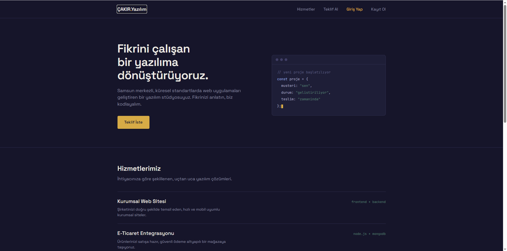
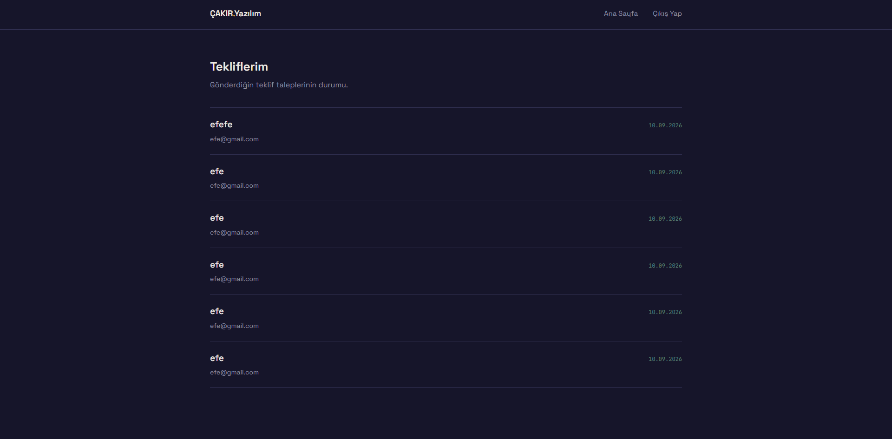
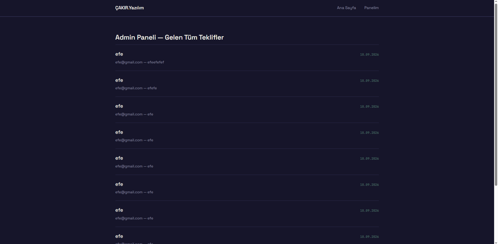

# ÇAKIR Yazılım

Samsun merkezli bir yazılım stüdyosu için geliştirilmiş, kullanıcı girişi, JWT tabanlı yetkilendirme ve admin paneli içeren tam kapsamlı bir MERN Stack web uygulaması.

🔗 **Canlı Demo:** https://cakiryazilim.onrender.com

## Özellikler

- JWT tabanlı kullanıcı kayıt/giriş sistemi (bcrypt ile şifreleme)
- Korumalı route'lar (middleware ile yetkilendirme)
- Kullanıcı paneli — kendi teklif taleplerini görüntüleme
- Admin paneli — tüm teklifleri görüntüleme (rol bazlı erişim kontrolü)
- MongoDB Atlas ile bulut veritabanı entegrasyonu
- Responsive, özel tasarım (terminal temalı hero bölümü)

## Kullanılan Teknolojiler

- **Frontend:** HTML, CSS, Vanilla JavaScript
- **Backend:** Node.js, Express.js
- **Veritabanı:** MongoDB (Atlas)
- **Auth:** JWT, bcryptjs
- **Deploy:** Render

## Ekran Görüntüleri

